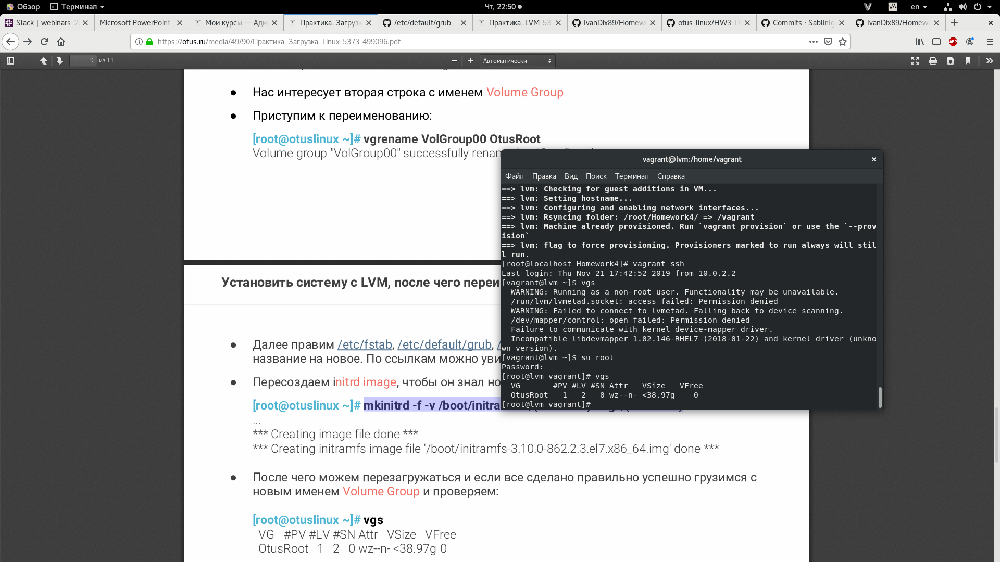
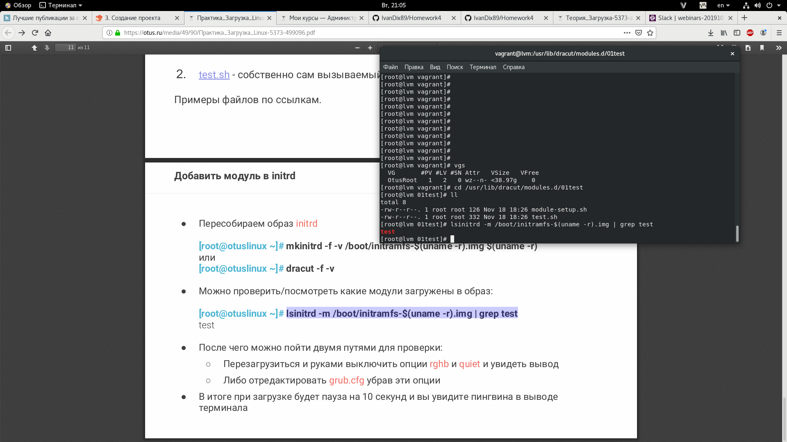
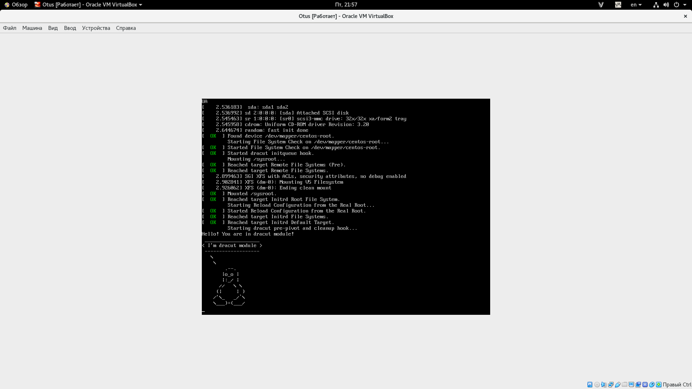

# Homework4

======================================

#### 1.Попасть в систему без пароля

#### 2. Установить систему с LVM, переименовать VG

Переименовываем VG

Перезагружаем

#### 3. Добавить модуль в initrd

Перезагружаем

*Прикрепил лог файл
